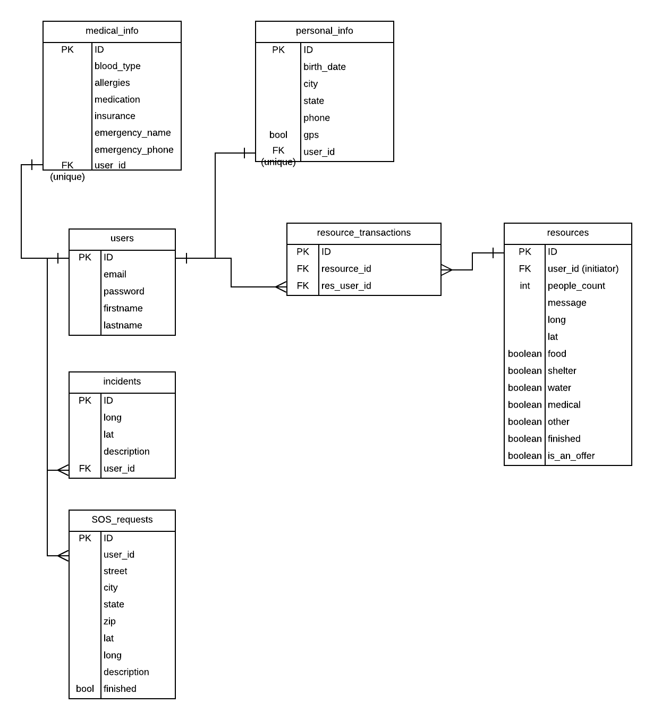

# onearc-backend

This backend is deployed at [https://onearcback.herokuapp.com/](https://onearcback.herokuapp.com/).

This repository is the backend for the react-native application for onearc, a result of AngelHack hackathon in Seattle, WA.

- This application allows users to stay safe and seek help during disaster.
- Users can report dangerours incidents around their neigborhood and view an interactive map of warnings and help requests.
- Users can also offer help or seek help from the community.

## Author

- Diep Truong

## Deployed backend 
- [https://onearcback.herokuapp.com/](https://onearcback.herokuapp.com/) - Front end can use this link as the BASE_URL to ping the back end. 

## Built With

- HTML/CSS/JavaScript
- Heroku, Surge
- Express
- NodeJS
- Materialize
- [BootStrap](http://www.getbootstrap.com/) - HTML/CSS Framework
- [Browserify](https://http://browserify.org/) - Used to provide require and build bundle.js
- [axios](https://www.npmjs.com/package/axios) - Promise based client for the browser and node.js
- [Moment.JS](https://momentjs.com/timezone/) - Parse & display dates/times properly.

## Installation

To install & run locally for development:

- fork this repo
- git clone
- npm install
- run psql, create a database (createdb onearc_dev)
- create .env file like the .env-sample.md
- npm run dev (run server)
- Use postman to test the routes

## Database Structure

[https://goo.gl/tMqF9j](ERD_link)

## Routes

BASEURL = localhost:5000/

## POSTMAN routes 
[https://www.getpostman.com/collections/0659d4deea1635c2cacf](Postman_Route)

### GET requests, incidents without logging in 
* GET /requests
* GET /incidents

### GET user(s) for front-end usage
* GET /api/users
* GET /api/users/:userId

### POST signup/login
* POST /api/users/login
Remember to set Authorization as Bearer Token in Postman, input the token.

* POST /api/users/signup

When creating a user, you will get a token back. Use that to test login route.

### CRUD actions for incidents
**ANY USER**
* GET /incidents?lat=37.688643&long=-122.45121&range=20
* GET /incidents/:inId

**AN AUTHORIZED USER**
* GET /incidents/byuser/:userId
* POST /incidents/byuser
* PATCH /incidents/byuser/:userId/update/:inId
* DELETE /incidents/byuser/:userId/delete/:inId

### CRUD actions for sos_requests
**ANY USER**
* GET /sosrequests?lat=37.688643&long=-122.45121&range=20
* GET /sosrequests/:reqId

**AN AUTHORIZED USER**
* GET /sosrequests/byuser/:userId (all sos requests, both finished and not)
* GET /sosrequests/byuser/:userId/current (get current SOS request)
* POST /sosrequests (create a SOS request)
* PATCH /sosrequests/:userId/update/:reqId (update a SOS request)
* PATCH /sosrequests/:userId/end/:reqId (end the current SOS request)
