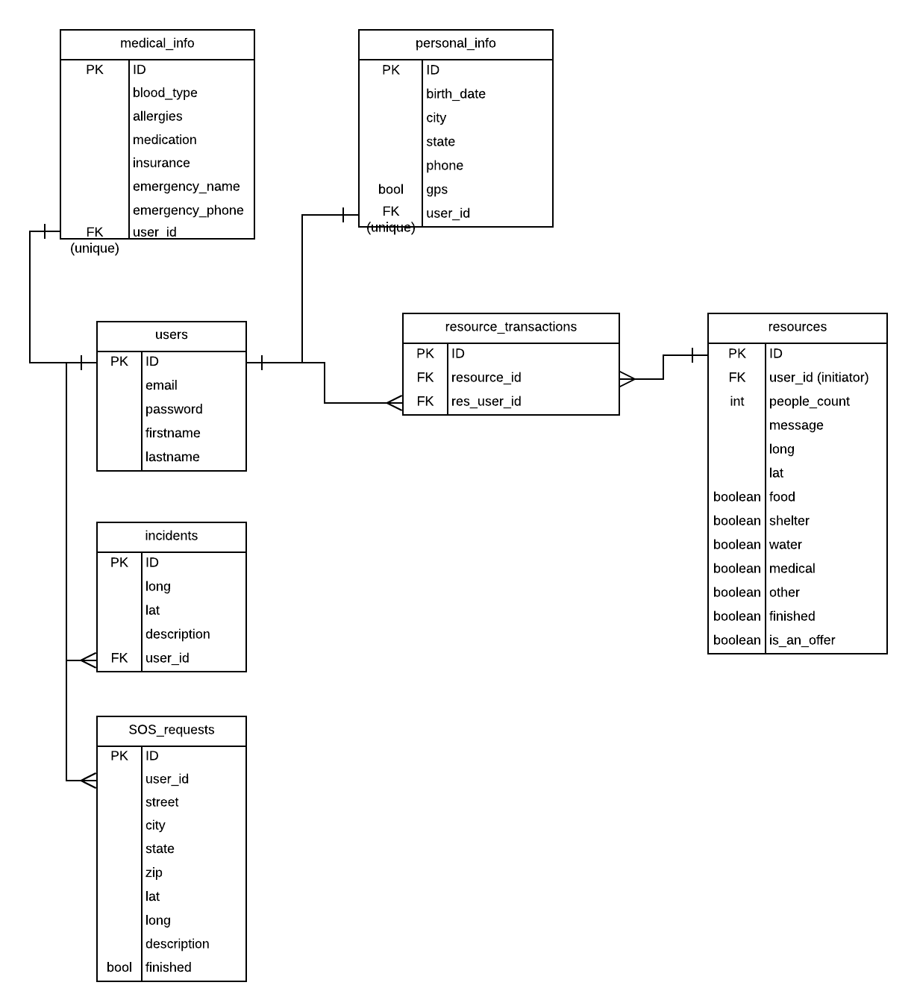
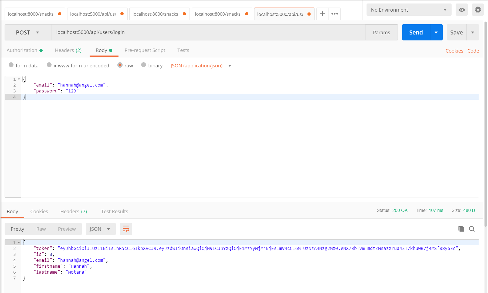
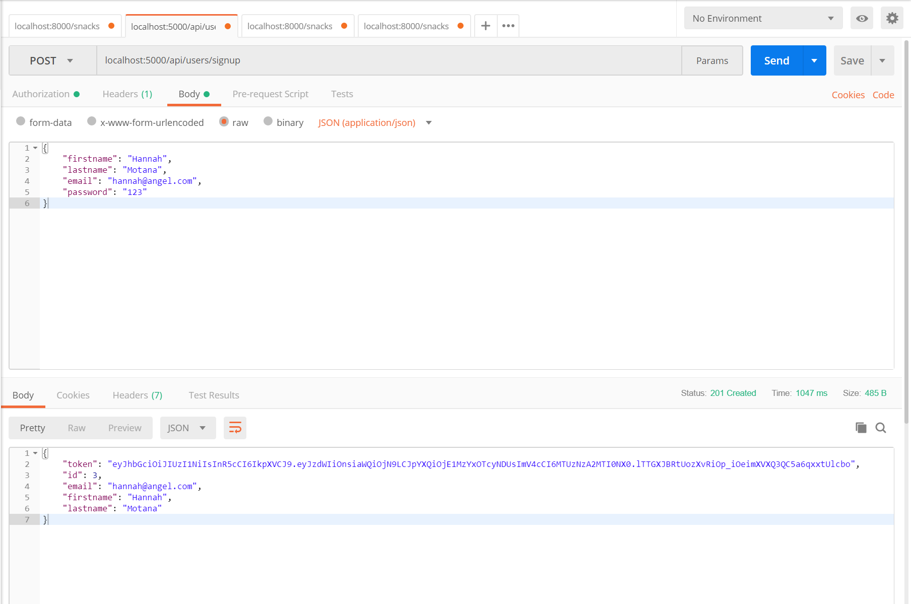

# onearc-backend

This repository is the backend for the react-native application for onearc, a result of AngelHack hackathon in Seattle, WA.

- This application allows users to stay safe and seek help during disaster.
- Users can report dangerours incidents around their neigborhood and view an interactive map of warnings and help requests.
- Users can also offer help or seek help from the community.

## Author

- Diep Truong

Students at [Galvanize](https://galvanize.com)

## Built With

- HTML/CSS/JavaScript
- Heroku, Surge
- Express
- NodeJS
- Materialize
- [BootStrap](http://www.getbootstrap.com/) - HTML/CSS Framework
- [Browserify](https://http://browserify.org/) - Used to provide require and build bundle.js
- [axios](https://www.npmjs.com/package/axios) - Promise based client for the browser and node.js
- [Moment.JS](https://momentjs.com/timezone/) - Parse & display dates/times properly.

## Installation

To install & run locally for development:

- fork this repo
- git clone
- npm install
- run psql, create a database (createdb onearc_dev)
- create .env file like the .env-sample.md
- npm run dev (run server)
- Use postman to test the routes

## Database Structure

## Routes

BASEURL = localhost:5000/

### GET requests, incidents without logging in 
* GET /requests
* GET /incidents

### GET user(s) for front-end usage
* GET /api/users
* GET /api/users/:userId

### POST signup/login
* POST /api/users/login
Remember to set Authorization as Bearer Token in Postman, input the token.

* POST /api/users/signup

When creating a user, you will get a token back. Use that to test login route.

### CRUD actions for incidents/requests are similar

* GET /api/:userId/incidents
* POST /api/:userId/incidents
* PATCH /api/:userId/incidents/:inId
* DELETE /api/:userId/incidents/:inId

### CRUD actions for requests responsed by helper, basically manipulating the bridge table requests_helper in ERD

* GET /api/:userId/helpout
* GET /api/:userId/helpout/:reqId
* POST /api/:userId/helpout
* PATCH /api/:userId/helpout/:reqId
* DELETE /api/:userId/helpout/:reqId
