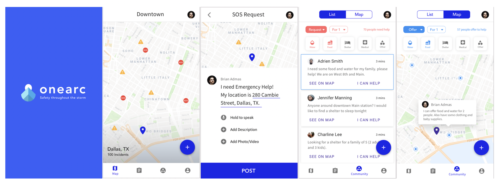

# ONEARC - BACKEND 

2018 AngelHack Global Demo Day Winner 
2018 AngelHack Hackcelerator Finalist 

### The Challenge
This project is a 4-month effort of an excited team that wants to change the way people get help during disasters. The team OneArc was formed after winning AngelHack Hackathon in Seattle, WA in July 2018. 

### Motivation 
With hurricane Harvey alone, 13 million people were affected and 135,000 homes were either damaged or destroyed. Most of disaster relief systems are swamped when disasters hit. We built OneArc, a holistic solution, to help people stay informed and assist one another during disasters. 

### Our Project 

OneArc is a seamless mobile app that allows users to report incidents or hazards on the map. Users can also ask for resources or provide help to their local community. 

### Links 
- Global Demo Day Pitch: http://bit.ly/onearcpitch
- Backend Github Repo: http://bit.ly/onearcbackend

### Author

- Diep Truong
- Dillon Easter

### Deployed backend 
- [https://onearcback.herokuapp.com/](https://onearcback.herokuapp.com/) - Front end can use this link as the BASE_URL to ping the back end. 

### Built With

- HTML/CSS/JavaScript
- Heroku, Surge
- Express
- NodeJS
- Materialize
- [BootStrap](http://www.getbootstrap.com/) - HTML/CSS Framework
- [Browserify](https://http://browserify.org/) - Used to provide require and build bundle.js
- [axios](https://www.npmjs.com/package/axios) - Promise based client for the browser and node.js
- [Moment.JS](https://momentjs.com/timezone/) - Parse & display dates/times properly.

### Installation

To install & run locally for development:

- fork this repo
- git clone
- npm install
- run psql, create a database (createdb onearc_dev)
- create .env file like the .env-sample.md
- npm run dev (run server)
- Use postman to test the routes

### Database Structure

[https://goo.gl/tMqF9j](ERD_link)

### Routes

BASEURL = localhost:5000/

### POSTMAN routes 
[https://www.getpostman.com/collections/0659d4deea1635c2cacf](Postman_Route)

### GET requests, incidents without logging in 
* GET /requests
* GET /incidents

### GET user(s) for front-end usage
* GET /api/users
* GET /api/users/:userId

### POST signup/login
* POST /api/users/login
Remember to set Authorization as Bearer Token in Postman, input the token.

* POST /api/users/signup

When creating a user, you will get a token back. Use that to test login route.

### CRUD actions for incidents
**ANY USER**
* GET /incidents?lat=37.688643&long=-122.45121&range=20
* GET /incidents/:inId

**AN AUTHORIZED USER**
* GET /incidents/byuser/:userId
* POST /incidents/byuser
* PATCH /incidents/byuser/:userId/update/:inId
* DELETE /incidents/byuser/:userId/delete/:inId

### CRUD actions for sos_requests
**ANY USER**
* GET /sosrequests?lat=37.688643&long=-122.45121&range=20
* GET /sosrequests/:reqId

**AN AUTHORIZED USER**
* GET /sosrequests/byuser/:userId (all sos requests, both finished and not)
* GET /sosrequests/byuser/:userId/current (get current SOS request)
* POST /sosrequests (create a SOS request)
* PATCH /sosrequests/:userId/update/:reqId (update a SOS request)
* PATCH /sosrequests/:userId/end/:reqId (end the current SOS request)
